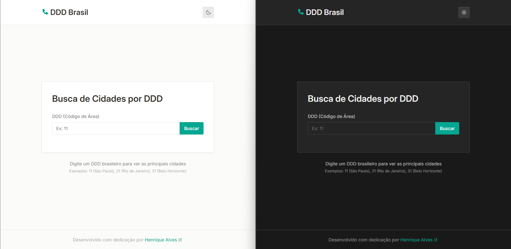

# 📞 DDD Brasil - Busca de Cidades por DDD

<p align="center">
  
</p>

## 🌐 Acesso Online

Você pode acessar a versão online do projeto [aqui](https://ddd.solidsistemas.com/).

## 🔎 Sobre o Projeto

O DDD Brasil é uma aplicação web moderna e intuitiva que permite aos usuários consultar rapidamente quais cidades pertencem a cada DDD (Discagem Direta à Distância) no território brasileiro.

Com uma interface clean e responsiva, o usuário pode simplesmente digitar um código DDD no campo de busca e obter instantaneamente uma lista completa de todas as cidades associadas àquele código de área telefônico.

Esta ferramenta é especialmente útil para:

- 🚚 Profissionais que trabalham com logística e entregas
- 📊 Equipes de marketing que planejam campanhas regionalizadas
- 🏢 Empresas com atendimento segmentado por região
- 👥 Qualquer pessoa que precise identificar a localização geográfica de um número telefônico

O sistema abrange todos os 67 DDDs brasileiros, desde grandes centros urbanos como São Paulo (11), Rio de Janeiro (21) e Belo Horizonte (31), até regiões mais remotas do território nacional.

<!--
Descrição detalhada do projeto será adicionada aqui.
Esta seção deve incluir o propósito do projeto, principais funcionalidades e tecnologias utilizadas.
-->

## 🛠️ Tecnologias Utilizadas

- React 19
- TypeScript
- Vite
- ESLint + Prettier
- Zod

## ✨ Recursos e Diferenciais

- **📱 Mobile First:** Design otimizado prioritariamente para dispositivos móveis, garantindo uma experiência perfeita em smartphones e tablets
- **🌙 Dark Theme:** Suporte completo a tema escuro, que se adapta automaticamente às preferências do sistema do usuário
- **🧹 Interface Minimalista:** Design limpo e intuitivo focado na usabilidade

## 📋 Pré-requisitos

Antes de começar, você precisa ter instalado em sua máquina:

- [Node.js](https://nodejs.org/) (versão 22 ou superior)
- npm (normalmente vem com o Node.js) ou [pnpm](https://pnpm.io/) ou [Yarn](https://yarnpkg.com/)

## 🚀 Instalação

Siga estes passos para configurar o ambiente de desenvolvimento:

1. Clone o repositório

   ```bash
   git clone git@github.com:henrique013/ddd.git
   cd ddd
   ```

2. Instale as dependências
   ```bash
   npm install
   # ou
   pnpm install
   # ou
   yarn install
   ```

## 🔐 Configuração de Variáveis de Ambiente

Para que a aplicação funcione corretamente, é necessário configurar as variáveis de ambiente.

Copie o arquivo `.env.example` para um novo arquivo chamado `.env`:

```bash
cp .env.example .env
```

Ajuste os valores das variáveis de ambiente caso necessário.

## ▶️ Executando o Projeto

Para iniciar o servidor de desenvolvimento:

```bash
npm run dev
# ou
pnpm dev
# ou
yarn dev
```

O projeto estará disponível em [http://localhost:5173](http://localhost:5173)

## ⌨️ Comandos Disponíveis

- `npm run dev` - Inicia o servidor de desenvolvimento
- `npm run build` - Gera uma versão otimizada para produção
- `npm run lint` - Executa a verificação de linting no código
- `npm run preview` - Previsualiza a versão de produção localmente _(requer execução prévia de `npm run build`)_

## 📁 Estrutura do Projeto

Estes são os arquivos e diretórios principais do projeto:

```
ddd/
├── public/             # Arquivos estáticos
├── src/
│   ├── assets/         # Imagens e outros recursos
│   ├── components/     # Componentes React reutilizáveis
│   ├── contexts/       # Contextos React
│   ├── hooks/          # Custom hooks
│   ├── services/       # Serviços e APIs
│   ├── utils/          # Utilitários
│   ├── di-container.ts # Container de injeção de dependências
│   ├── env.ts          # Variáveis de ambiente
│   ├── errors.ts       # Erros personalizados
│   ├── index.css       # Estilos globais
│   └── main.tsx        # Ponto de entrada da aplicação
├── index.html          # Página HTML principal
└── ...                 # Arquivos de configuração
```

## 📧 Contato

- LinkedIn: [Henrique Alves](https://www.linkedin.com/in/henrique-alves-a44b99135)
- GitHub: [henrique013](https://github.com/henrique013)
